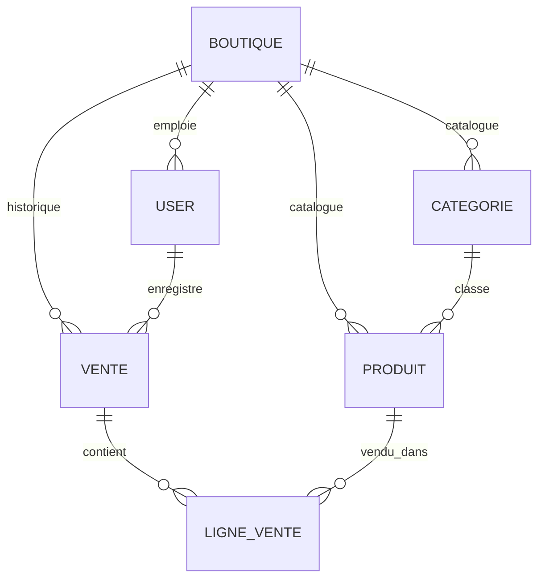

<p align="center">
  
  
  
  
  
</p>

# 🏪 Boutique Quartier

Application web **multi-boutique** de vente et de gestion de stock pour les petits commerces de quartier (épiceries, superettes...). Chaque boutique s'inscrit indépendamment et dispose de son propre catalogue, de son propre stock, de son historique de ventes et de son équipe — sans aucune donnée partagée entre boutiques.

Construit avec **Laravel 9**, **MySQL** et **Bootstrap 5** (pas de build front-end requis).

## ✨ Fonctionnalités

**Vente / caisse (POS)**
- Interface de vente rapide : recherche produit, panier interactif, calcul automatique du total
- Décrément de stock atomique (transaction + verrou pessimiste) pour éviter toute survente en cas d'accès concurrent
- Génération de reçu imprimable et export **PDF** (format ticket de caisse 80mm)

**Gestion de stock**
- CRUD produits avec catégories, prix d'achat/vente, quantité en stock
- Seuils d'alerte configurables par produit avec badges visuels (stock bas / rupture)

**Rapports & statistiques**
- Chiffre d'affaires et nombre de ventes sur une période personnalisable
- Classement des produits les plus vendus
- Ventes par jour, paginées

**Multi-boutique & sécurité**
- Chaque boutique s'inscrit elle-même (`/register`) : création automatique du compte gérant
- Isolation stricte des données entre boutiques (vérifiée à chaque requête, y compris sur les accès directs par ID)
- Deux rôles : **Gérant** (accès complet) et **Vendeur** (vente + consultation stock uniquement), appliqués via un middleware dédié

## 🏗️ Architecture des données



Toute requête métier est automatiquement filtrée par `boutique_id` (voir `Controller::boutiqueId()`), et les routes de gestion (produits, catégories, rapports, utilisateurs) sont protégées par un middleware `role:gerant`.

## 🚀 Installation locale

```bash
git clone https://github.com/Anani23/boutique-quartier.git
cd boutique-quartier
composer install
cp .env.example .env
php artisan key:generate
```

Configurer la base de données dans `.env` (`DB_DATABASE`, `DB_USERNAME`, `DB_PASSWORD`), puis :

```bash
php artisan migrate --seed
php artisan serve
```

Le seeder crée une boutique de démonstration ("Épicerie du Coin") avec des produits, catégories et ventes d'exemple.

## 🔑 Comptes de démonstration

| Rôle    | Email                     | Mot de passe |
|---------|---------------------------|---------------|
| Gérant  | `gerant@boutique.test`    | `password`    |
| Vendeur | `vendeur@boutique.test`   | `password`    |

## 🛠️ Stack technique

- **Backend** : Laravel 9 / PHP 8.0
- **Base de données** : MySQL
- **Frontend** : Blade + Bootstrap 5 (CDN, sans étape de build)
- **PDF** : [barryvdh/laravel-dompdf](https://github.com/barryvdh/laravel-dompdf)

## 📋 Pistes d'évolution

- [ ] Photos produits
- [ ] Export CSV des rapports
- [ ] Notifications de stock bas par email
- [ ] API mobile pour la caisse
